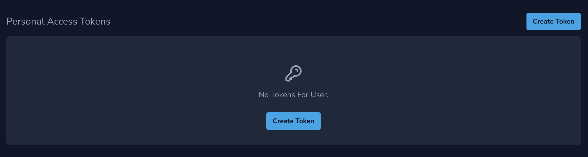
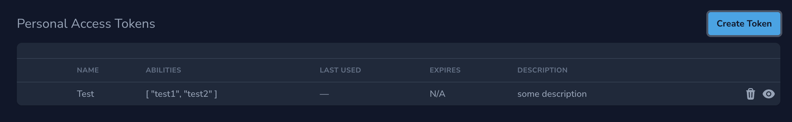
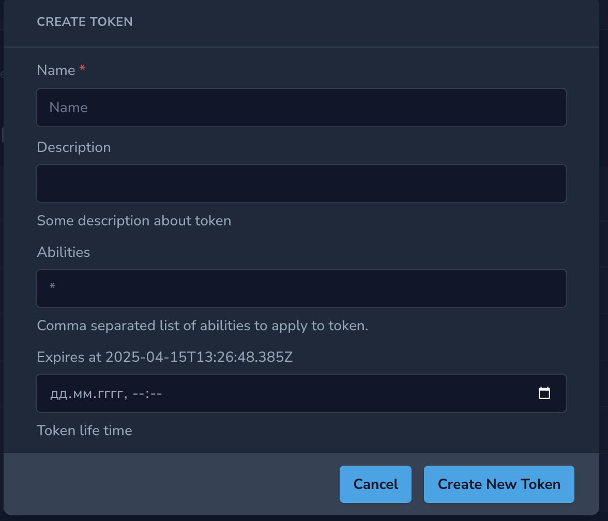
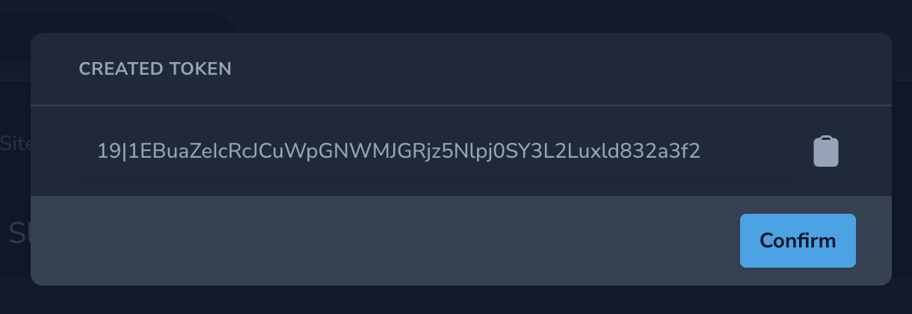
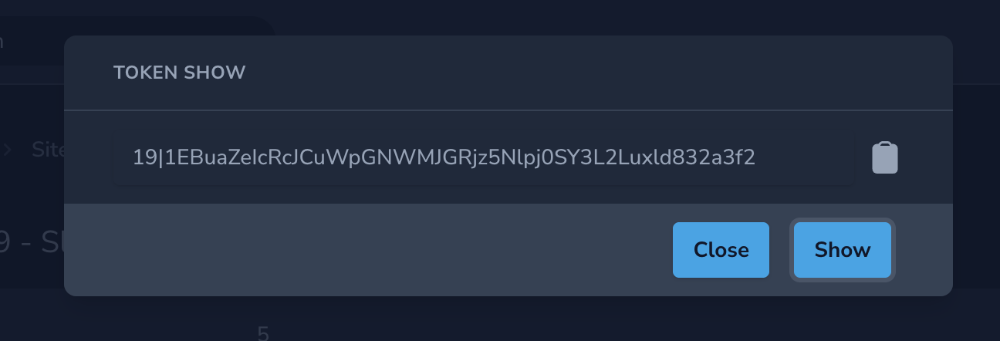

# Create a Sanctum Personal Access Tokens in Nova

This package allows you to use [Sanctum](https://laravel.com/docs/12.x/sanctum) to generate a Personal Access Tokens in [Nova](https://nova.laravel.com/).

## Screenshot








## Prerequisites

1. [Install and Configure Sanctum](https://laravel.com/docs/12.x/sanctum#installation)
2. [Have Laravel Nova](https://nova.laravel.com/)
   - Support - Nova 4.x Nova 5.x
   - Laravel 10.x, 11.x, 12.x

## Installation

```
composer require metasync-site/sanctum-tokens
```

Register the plugin by adding `SanctumTokens::make()` to the array of fields in the Nova resource. Make sure the
`HasApiTokens` trait from the Sanctum package has been added to your model.

```php
use MetasyncSite\SanctumTokens\SanctumTokens;

public function fields(Request $request)
{
    return [
        SanctumTokens::make(),
    ];
}

```

## Features

### Hide Abilities

You can hide the reference to the token abilities from the UI by calling the `hideAbilities()` method on the field.

```php
use MetasyncSite\SanctumTokens\SanctumTokens;

public function fields(Request $request)
{
    return [
        SanctumTokens::make()->hideAbilities(),
    ];
}

```

### Set Default Abilities

If you don't want to use the default `*` token ability you can set your own by simply passing an array of strings to the `defaultAbilities()` method on the field.

This works well with the the `hideAbilities()` method if you want to hide the abilities logic from your users.

```php
use MetasyncSite\SanctumTokens\SanctumTokens;

public function fields(Request $request)
{
    return [
        SanctumTokens::make()->defaultAbilities(['crm', 'cms']),
    ];
}
```

### Localization

Publish the package language files to your application's `resources/lang/vendor` directory:

```
php artisan vendor:publish --provider="MetasyncSite\SanctumTokens\ToolServiceProvider" --tag="sanctum-tokens-migrations"
```
